# Introduction
A detailed benchmark of several solutions, including AVX2 and AVX512 entries,
for the problem posed in [Advent of Code 2022 day 6 part 2](https://adventofcode.com/2022/day/6),
and an analysis of Primeagen's video on the matter.
In short, the challenge is to find the first window of 14 unique bytes in a string of `[a-z]*`.

I started this a few months ago after seeing [Primeagen's YouTube video comparing several solutions](https://www.youtube.com/watch?v=U16RnpV48KQ) 
and later a [stream by Gamozo Labs attempting to find an AVX512 solution for the same problem](https://www.youtube.com/watch?v=ru97E9xA0s4).

Initially, I wanted to see what effect reusing the `HashMap`s and `Vec`s would have in the first few solutions Prime showed.
I had also recently gotten a CPU with AVX512 and was vectorizing various algorithms, so I took a stab at that, too! 
As is often the case with micro-optimization, I got more than I bargained for... 

In this post, I demonstrate a severe flaw in Prime's benchmarking methodology and present several improved algorithms.
Along the way, we'll encounter some curiosities that can cripple the performance of a tight loop.

## Credits
First things first, kudos to Prime for making engaging content on this subject, 
and kudos to Benny and David for their solid algorithms. 

[Primeagen's repo](https://github.com/ThePrimeagen/aoc/blob/2022/src/bin/day6_2.rs)  
[Primeagen's YouTube video](https://www.youtube.com/watch?v=U16RnpV48KQ)  
[Benny's GH](https://github.com/Ben-Lichtman)  
[David's GH](https://github.com/david-a-perez)  

# Results Sneak Peek
A quick summary of interesting findings. David A. Perez's algorithm will be referred to as `dap`.

### Prime's data vs Random Data
`dap` loses its advantage over Benny's algorithm when given completely random data.
Within each subplot, the left group is Prime's data and the right group is 600MB of random data with a window at the very end.
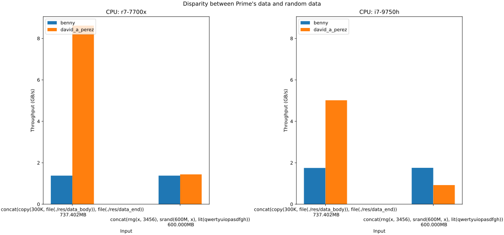  
This indicates that Prime's input is very favorable to `dap`. Let's see why that is.

### Throughput of David's algorithm as random sequence length increases
The below chart plots the throughput `y` of `dap` on a 300MB input created by repeating a random sequence `x` bytes long.
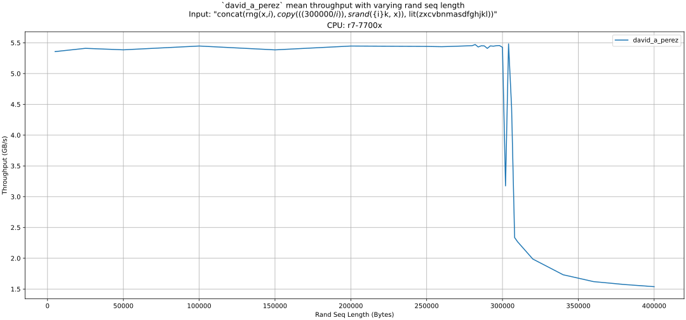  
Due to the branchy nature of `dap`, given input built by repeating a short enough sequence,
the CPU might actually learn the pattern of branches and take them speculatively.
A mis-predicted branch stalls execution, so having unnaturally predictable branches inflates the performance.
Prime's input is created by repeating a 2.4KB file 300 thousand times, which makes for an extremely predictable input.
The branch predictor only has so much capacity, though, so performance will tank after some CPU-specific length.
This turning point is at about 308K bytes on my AMD 7700x.

These next 2 plots shows the speed `y` of `dap` against the trial number `x`, with each line being a different input.
The sequence length appears in the `srand(_, ...)` term. No warmup iterations are performed.
This was inspired by [a similar test shown by Daniel Lemire in his SIMD JSON talk](https://www.youtube.com/watch?v=wlvKAT7SZIQ&t=860s).
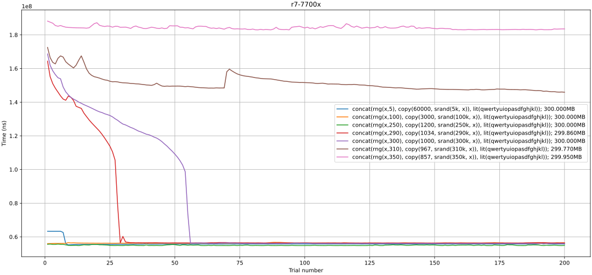  
For the 7700x, sequences under 250KB are learned extremely quickly,
while 290KB and 300KB take a few dozen trials but eventually reach the same speed.
Beyond that, the peak speed gets progressively slower.
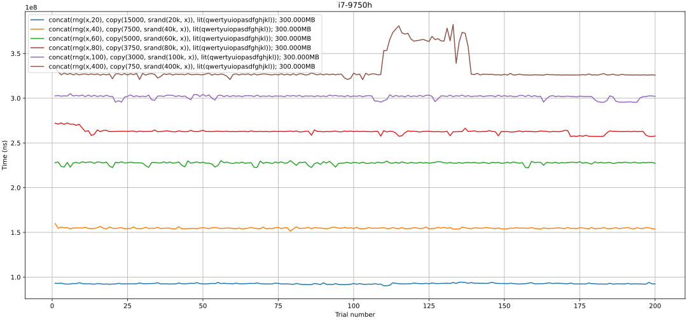  
Meanwhile, the story is completely different for the i7 9750h -
I could not find any sequence length where the same sort of learning occurred.
Instead, speed is a function of the sequence length, and trial number plays no role.

To clarify, what's shown above is not some cache effect - the full input is several hundred megabytes,
which is well outside the size of our L3 cache. This is all the branch predictor.
One might suggest that glibc's `memcpy` (used while building the inputs) 
was actually mapping copied pages onto the same few physical pages -
that wouldn't explain this behavior, but we don't need to guess as we have `perf`.

---
stats for `dap` on Prime's input, CPU=R7 7700x
```
    34,892,847,228      cycles:u                         #    5.357 GHz                         (38.46%)
        44,485,557      stalled-cycles-frontend:u        #    0.13% frontend cycles idle        (38.46%)
   170,434,697,117      instructions:u                   #    4.88  insn per cycle            
                                                  #    0.00  stalled cycles per insn     (38.46%)
    33,976,234,219      branches:u                       #    5.217 G/sec                       (38.46%)
            62,207      branch-misses:u                  #    0.00% of all branches             (38.46%)
    28,447,613,568      L1-dcache-loads:u                #    4.368 G/sec                       (38.46%)
       876,293,562      L1-dcache-load-misses:u          #    3.08% of all L1-dcache accesses   (38.46%)
```
And we can see an absurdly low `0.00%` branch miss rate on Prime's input.

---
stats for `dap` on 3KB random repeated 200K times, CPU=R7 7700x.
```
    45,720,879,727      cycles:u                         #    5.399 GHz                         (38.44%)
        46,000,070      stalled-cycles-frontend:u        #    0.10% frontend cycles idle        (38.45%)
   220,130,869,990      instructions:u                   #    4.81  insn per cycle            
                                                  #    0.00  stalled cycles per insn     (38.47%)
    42,102,099,585      branches:u                       #    4.972 G/sec                       (38.48%)
         1,100,894      branch-misses:u                  #    0.00% of all branches             (38.49%)
    36,702,993,454      L1-dcache-loads:u                #    4.334 G/sec                       (38.50%)
       712,536,442      L1-dcache-load-misses:u          #    1.94% of all L1-dcache accesses   (38.48%)
```
My random input generation is a bit harsher than the AOC input, but the pattern holds.

---
stats for `dap` on 600MB random input, CPU=R7 7700x
```
   202,260,046,938      cycles:u                         #    5.462 GHz                         (38.46%)
    45,942,857,439      stalled-cycles-frontend:u        #   22.71% frontend cycles idle        (38.46%)
   287,440,654,601      instructions:u                   #    1.42  insn per cycle            
                                                  #    0.16  stalled cycles per insn     (38.46%)
    55,694,309,049      branches:u                       #    1.504 G/sec                       (38.47%)
     6,222,624,301      branch-misses:u                  #   11.17% of all branches             (38.47%)
   101,832,625,214      L1-dcache-loads:u                #    2.750 G/sec                       (38.47%)
       722,758,929      L1-dcache-load-misses:u          #    0.71% of all L1-dcache accesses   (38.46%)
```
This confirms that missed branches are the primary cause and that Prime's method of generating input is unfairly biased to `dap`.

### Worst case inputs
Inputs where the duplicate characters are arranged such that an algorithm like `dap` or `conflict`
can only advance 1, 3 or 5 characters a time.
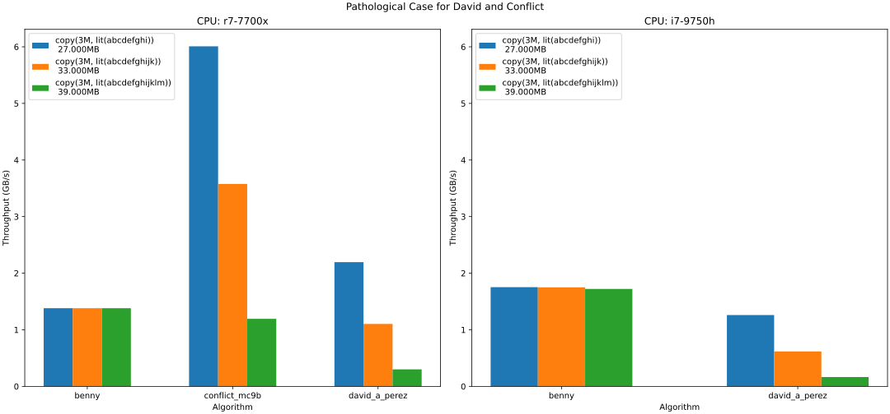  
`dap` is especially hard-hit because it must do 13 comparisons just to advance 1 byte.
In short, `dap` is the most sensitive to the input while `benny` is totally unaffected.

### Best case inputs
"aaaa", "abababab" and "abcabcabc"
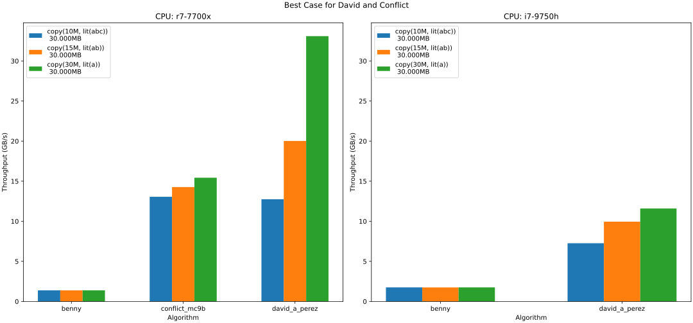  
On inputs with just 1, 2 or 3 repeating characters, `dap` can rapidly skip large chunks at a time.
However, this is fairly contrived, and we can see that even a length of 3 is enough for `conflict_mc9b`,
one of my AVX512 solutions, to overtake it. If long spans of one character were truly the common case,
there are other methods that can scan for one character even faster.

# Analysis

## Hardware
| CPU                 | Family      | Release Year | Cores  | RAM               | L3 cache | Best SIMD |
|---------------------|-------------|:------------:|--------|-------------------|----------|-----------|
| AMD Ryzen 7 7700x   | Zen 4       |     2022     | 8C/16T | 32GB DDR5 6000MHz | 32MB     | AVX512    |
| Intel Core i7 9750h | Coffee Lake |     2019     | 6C/12T | 16GB DDR4 2666MHz | 12MB     | AVX2      |
| Intel Core i7 870   | Nehalem     |     2009     | 4C/8T  | 12GB DDR3 1333MHz | 8MB      | SSE4.2    |

All of the above processors have 32KB L1d and L1i per core.

Unfortunately, my i7 870 system died shortly before I could run the updated benchmarks :(.
The one interesting result from it was 1.16 GB/s on `benny`, which I thought was remarkable for a 2009 CPU.
Generally, it behaved like a scaled-down 9750h.

## Algorithms
Before getting into comparing the algorithms,
let's look over the design of each algorithm individually to contextualize the results.
I won't go in-depth explaining how Benny's and `dap` work as they were covered in Prime's video.

### Upper bounds
As a start, it helps to establish upper bounds for throughput.
In this problem, that would be how fast we can load the data.
The below line charts compare the throughput achieved with various element sizes.
`load_1B` corresponds to loading 1 byte of memory at a time.
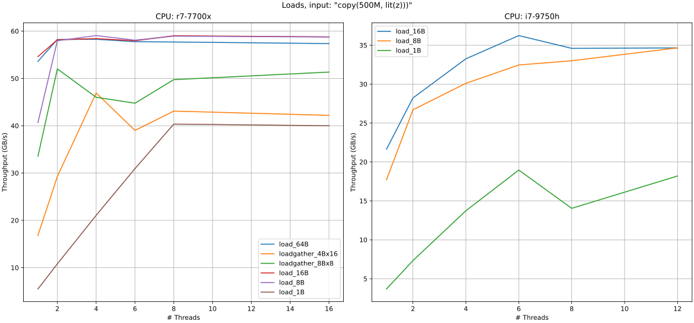  
On the Zen 4, the AVX512 gathers `loadgather_4Bx16` and `loadgather_8Bx8` -
which correspond to the instructions `vpgatherdd` and `vpgatherdq` -
perform fairly poorly, only outpacing `load_1b`. Looking at [Agner Fog's instruction tables](https://agner.org/optimize/),
or [the table at uops.info](https://uops.info/table.html?search=vpgatherd%20z&cb_lat=on&cb_tp=on&cb_uops=on&cb_ZEN4=on&cb_measurements=on&cb_avx512=on),
we see that these results match expectations.

Also note the poor throughput achieved with `load_1b` on one thread -
this presents a fairly low ceiling for an algorithm like Benny's that visits every byte one-by-one.


### Benny
Rust source code
```rust
pub fn benny(input: &[u8]) -> Option<usize> {
    if input.len() < 14 {
        return None;
    }
    let mut filter = 0u32;
    input
        .iter()
        .take(14 - 1)
        .for_each(|c| filter ^= 1 << (c % 32));

    input.windows(14).position(|w| {
        let first = w[0];
        let last = w[w.len() - 1];
        filter ^= 1 << (last % 32);
        let res = filter.count_ones() == 14;
        filter ^= 1 << (first % 32);
        res
    })
}
```
hot loop assembly (`-Ctarget-cpu=x86-64-v2` or higher)
```asm
.LBB119_4:
	movzx r9d, byte ptr [rdi + rdx + 13]     ; let last = w[w.len() - 1];
	btc r8d, r9d                             ; filter ^= 1 << (last % 32);
	xor r9d, r9d
	popcnt r9d, r8d                          ; filter.count_ones()
	cmp r9d, 14                              ;                     == 14;
	je .LBB119_5                             ; break condition for position
	movzx r9d, byte ptr [rdi + rdx]          ; first = w[0];
	btc r8d, r9d                             ; filter ^= 1 << (first % 32);
	inc rdx
	cmp rsi, rdx
	jne .LBB119_4                            ; break condition for windows
	mov rdx, rcx
	ret

```
This walks through the input one byte at a time, maintaining a bitmask of the last 14 encountered characters.
No individual instruction is particularly expensive, the branches are predictable (always false until the end),
and the memory access pattern is pre-fetcher-friendly, but it's still quite a bit of work for just one byte.
Notably, there is a data dependency on the filter variable. We'll look at the effects this has in a later section.

The algorithm makes heavy use of `.count_ones()`, which corresponds to `popcnt` on newer hardware.
`popcnt` is absent on the default target and enabled when targeting `x86-64-v2` or higher (which includes `skylake`).
Performance is crippled without enabling that instruction:
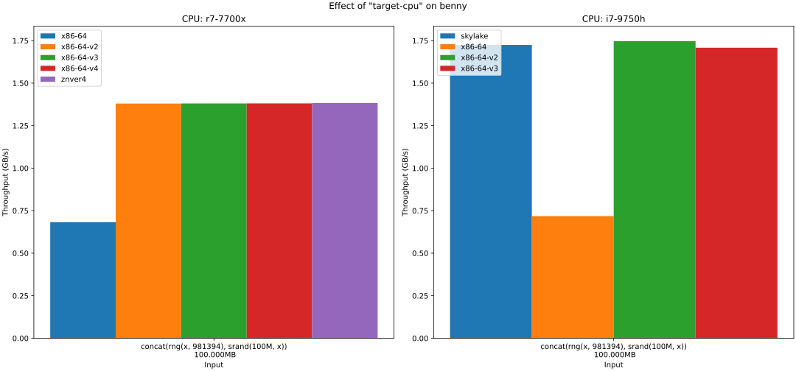  

I added a variant of benny prefixed with `#[target_feature(enable = "popcnt")]`.
On the 7700x this gets the default target up to par, but the story is different for the i7 9750h.
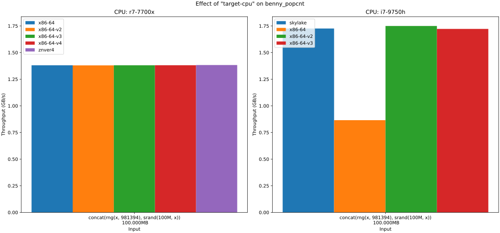  
There's an interesting tangent I explore here https://godbolt.org/z/j14n5axvG,
which explains why adding one bogus instruction doubles the performance on the i7 9750h.

### David A Perez
```rust
fn david_a_perez(input: &[u8]) -> Option<usize> {
    let mut idx = 0;
    while let Some(slice) = input.get(idx..idx + 14) {
        let mut state = 0u32;

        if let Some(pos) = slice.iter().rposition(|byte| {
            let bit_idx = byte % 32;
            let ret = state & (1 << bit_idx) != 0;
            state |= 1 << bit_idx;
            ret
        }) {
            idx += pos + 1;
        } else if state.count_ones() == 14 {
            return Some(idx);
        }
    }
    None
}
```
Hot loop asm with "-Ctarget-cpu=x86-64-v4"
(has AVX512VL extension which backports newer instructions to the smaller xmm registers).
This snippet corresponds to the first 2 iterations of `slice.iter().rposition()`
```asm
.LBB115_4:
	movzx r8d, word ptr [rdi + rdx + 12]     ; load first 2 bytes
	vmovd xmm2, r8d                          ; copy from general-purpose register to vector register
	vpand xmm2, xmm2, xmm0                   ; vectorized (char &= 31)
	vpmovzxbd xmm2, xmm2                     ; zero-extend first 4 1-byte lanes into 4 4-byte lanes 
	vpsllvd xmm2, xmm1, xmm2                 ; vectorized (1 << char)
	vmovd r9d, xmm2                          ; copy 1st lane from vector register to general-purpose register
	vpextrd r10d, xmm2, 1                    ; extract 2nd lane into another general-purpose register
	mov r8d, 13                              ; load a constant
	test r9d, r10d                           ; check if the first 2 elements are equal, effectively
	jne .LBB115_17                           ; jump out if they are equal.
	or r9d, r10d                             ; bitwise-or the one-hot encoded first 2 chars
	movzx r10d, byte ptr [rdi + rdx + 11]    ; load 3rd-to-last byte
	mov r8d, 12                              ; load constant
	...
```
In Prime's video, he highlights that SIMD sequence as part of the reason `dap` is so fast.
However, all that's really being done in parallel is the shifting of two characters.
To facilitate the SIMD, several instructions are needed just to shuttle 2 elements back and forth.
In practice, the SIMD version performs markedly *worse*, as seen on the left half of this graph.
(The SIMD portion requires AVX512-VL, so it's the red and purple bars on the left)
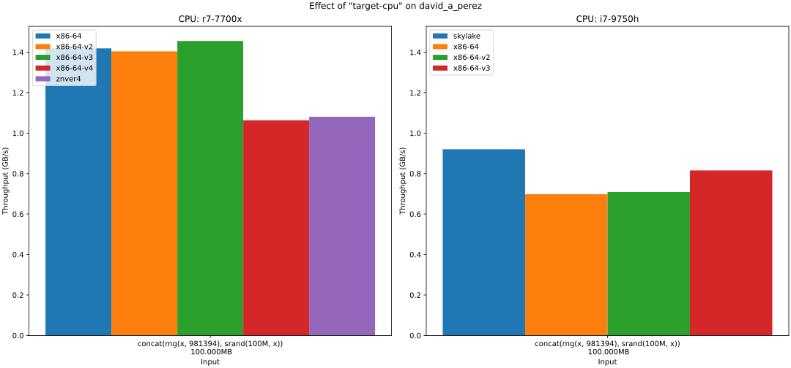  
In short, this sequence is actually a shining example of auto-vectorization not being all that great,
at least this paradigm. If you want SIMD, then you have to design around it, not hope for "surprise vectorization."


### My solutions
My `conflict` and `gather` solutions are essentially SIMD analogues of David's and Benny's solutions.
However, a naive translation was not sufficient; some work was needed to increase ILP (instruction-level parallelism) to
make the vector routines a net win.

### Conflict
So, we saw that the compiler's auto-vectorization didn't help much for `dap`.
Maybe we can do better, though. What if we could compare all 14 bytes for duplicates at once?
If only there were an instruction for that...

There is.

`vpconflictd` takes a vector of 16 4-byte elements and compares each lane against earlier lanes,
producing a bitmask of matches.
Here's a diagram for 4 elements:
```
lane numbers
   1     2    3     4
input elements
[   1,    2,    2,    1]
resulting bitmasks in binary, (MSB...LSB)
[0000, 0000, 0010, 0001]
This says that the 3rd lane matched the 2nd lane, and the 4th lane matched the first lane.
```

But, that isn't quite the information we wanted...
```
Using David's logic, given the chunk
"abcdefabcdefab"
        ^
we want to know the highest index of a byte that matches a **later** character.
That would be the second b in this example
```
But `vpconflictd` finds matches against earlier elements - it's backwards^!
Fortunately, we can simply reverse the elements with a shuffle first.
```
"abcdefabcdefab"
becomes
"bafedcbafedcba"
```
We don't care about which lane they match, so we can collapse each lane's bitmask
to 1 or 0, representing 'some match' and 'no match'.
Running conflict on the reversed string gets us
```
"bafedcbafedcba"
[00000011111111]
LSB          MSB
```
This bitvector is ordered as: `[lowest lane ... highest lane]`.
Since it's reversed, we want to find the index of the lowest set bit.
That corresponds to the latest character that matched an even later character.
That operation is called "count trailing zeros", which is a cheap instruction on modern x86-64 hardware.

^Instead of reversing the bytes we could find the highest set bit among the lanes in the bitmask,
but I don't think we have a fast `horizontal or` available.

#### First iteration source code  

core routine
```rust
unsafe fn avx512_window_to_mask(bytes_16: __m128i, reverse_shuffle_first14: __m128i) -> u16 {
    // reverse lanes [0:13], zero out 14 and 15 (last two)
    let rev_bytes_16 = _mm_shuffle_epi8(bytes_16, reverse_shuffle_first14);
    // widen u8*16 to u32*16
    let rev_u32_16 = _mm512_cvtepu8_epi32(rev_bytes_16);
    // compare each lane against *previous* lanes, producing a bitmask of matches for each lane
    // (this is why we had to reverse. so that low bytes end up in high lanes and
    // would be compared with high bytes)
    let rev_bitmask32_16 = _mm512_conflict_epi32(rev_u32_16);
    // get a mask of which lanes are nonzero
    let rev_nonzeros_mask16 =
        _mm512_mask2int(_mm512_test_epi32_mask(rev_bitmask32_16, rev_bitmask32_16));
    rev_nonzeros_mask16 as u16 & 0x3FFF
}
```
---
Outer loop
```rust
pub unsafe fn conflict(input: &[u8]) -> Option<usize> {
    if input.len() < 14 {
        return None;
    }
    let reverse_shuffle_first14: __m128i =
        _mm_set_epi8(-1, -1, 0, 1, 2, 3, 4, 5, 6, 7, 8, 9, 10, 11, 12, 13);
    let mut idx = 0;
    while let Some(slice) = input.get(idx..(idx + 16)) {
        let rev_dup_lanes_mask = avx512_window_to_mask(
            _mm_loadu_si128(slice.as_ptr().cast()),
            reverse_shuffle_first14,
        );
        if rev_dup_lanes_mask == 0 {
            return Some(idx);
        } else {
            let trailing_zeros = rev_dup_lanes_mask.trailing_zeros() as usize;
            idx += 1 + 13 - trailing_zeros;
        }
    }
    // very lazy way of handling the last 1-2 iters
    input.get(idx..).and_then(benny).map(|i| i + idx)
}
```
---
loop asm
```asm
.LBB81_4:
	vmovdqu xmm1, xmmword ptr [rdi + rbx]    ; load 16 bytes
	vpshufb xmm1, xmm1, xmm0                 ; reverse the first 14 bytes
	vpmovzxbd zmm1, xmm1                     ; zero-extend 16 1-byte lanes into 16 4-byte lanes
	vpconflictd zmm1, zmm1                   ; find conflicts against previous lanes
	vptestmd k0, zmm1, zmm1                  ; produce mask of non-zero lanes
	kmovd eax, k0                            ; move that result to a general-purpose register
	and ax, 16383                            ; keep the low 14 bits
	je .LBB81_5                              ; break out if zero
	tzcnt ecx, eax                           ; count trailing zeros
	mov rax, rbx
	sub rax, rcx                             ;                - trailing_zeros;
	lea rbx, [rax + 14]                      ; idx += 1 + 13
	cmp rbx, -17
	ja .LBB81_6
	lea rcx, [rax + 30]
	cmp rcx, rsi
	jbe .LBB81_4
```
When I finally got this algorithm right, I excitedly went to benchmark it aaaand...
It wasn't very fast. Profiling with `perf` revealed an IPC (instructions per cycle) of just **0.57**,
which is extremely low.
This means that, on average, each instruction took nearly 2 cycles to complete. 
For reference, this same chip (7700x) has hit ~6 IPC on other routines.
We expect a lower IPC with SIMD workloads but this is too far.
The cause is a long dependency chain - most of the instructions depend on the result of the prior instruction.
There simply isn't any opportunity to execute instructions in parallel. 
There's nothing to do *but* wait. So, we need to find a way to rearrange the work.

#### Improving IPC
My approach, inspired heavily by
[Thomas Wue's 1BRC submission](https://github.com/gunnarmorling/1brc/pull/606/commits/c0c6476d9904ad69d585d9695ce68bb21e85c601#diff-f3749e0448efb5853586dadaa6d3bf87c4c9d18735067efd3ad6678ecda28e82R305-R331),
was to divide the input into `K` chunks,
and interleave the execution of one iteration on each of the `K` chunks.
Each of the `K` streams are independent, so their instructions can be processed in parallel.
Another key detail for being able to apply this technique is that
each iteration does a constant amount of work, unlike one iteration of `dap`, for example.

I manually unrolled the loop by 2x, then 3x, then 4x and was pleasantly surprised as the 
throughput scaled nearly perfectly. After 5x, I generalized the algorithm with const generics.
The loop now looks like:
```rust
'outer: loop {
    // do all the bounds checking
    let mut slices = [input as &[u8]; NUM_CURSORS];
    for (i, e) in slices.iter_mut().enumerate() {
        if let Some(s) = inputs[i].get(indices[i]..indices[i] + 16) {
            *e = s;
        } else {
            break 'outer;
        }
    }
    let masks: [u16; NUM_CURSORS] = {
        let mut a = [0u16; NUM_CURSORS];
        for (i, e) in a.iter_mut().enumerate() {
            *e = avx512_window_to_mask(
                _mm_loadu_si128(slices[i].as_ptr().cast()),
                reverse_shuffle_first14,
            );
        }
        a
    };

    let e = indices.iter_mut().zip(masks).try_for_each(|(idx, msk)| {
        if msk == 0 {
            Err(())
        } else {
            *idx += 1 + 13 - msk.trailing_zeros() as usize;
            Ok(())
        }
    });
    if e.is_err() {
        break;
    }
}
```
I didn't interleave the instructions between instances of `avx512_window_to_mask`,
but the CPU's out-of-order execution capabilities seemed to cope just fine.
The const generic version produced slightly larger assembly to the hand-rolled equivalent but had almost identical performance.
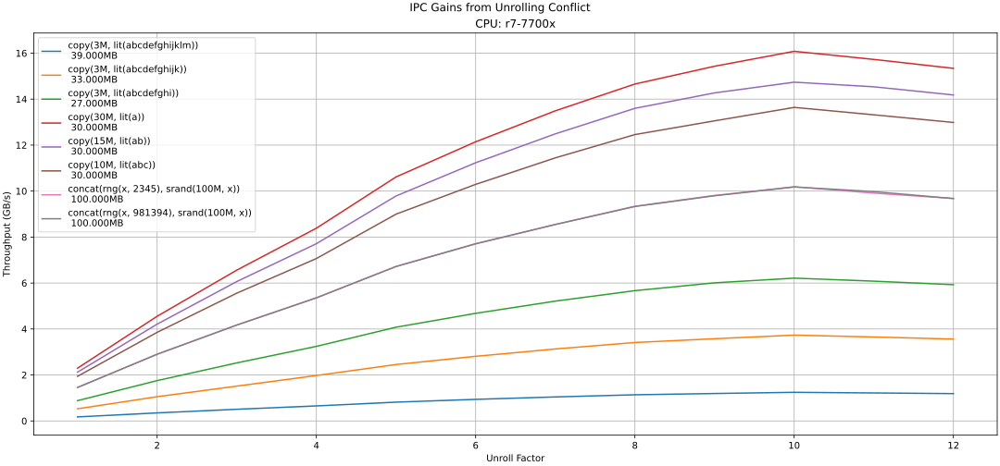
Just like `dap`, worst-case inputs can cause `conflict` to only advance one byte at a time.

Perf stats w/ input `concat(rng(x, 126), copy(20, srand(10M, x)))`:

---
`conflict`
```
   293,725,391,533      cycles:u                         #    5.304 GHz                         (38.45%)
       137,954,260      stalled-cycles-frontend:u        #    0.05% frontend cycles idle        (38.46%)
   165,841,668,560      instructions:u                   #    0.56  insn per cycle            
                                                  #    0.00  stalled cycles per insn     (38.46%)
    29,296,087,166      branches:u                       #  529.053 M/sec                       (38.46%)
         8,366,562      branch-misses:u                  #    0.03% of all branches             (38.46%)
    12,561,518,633      L1-dcache-loads:u                #  226.846 M/sec                       (38.47%)
     1,255,106,541      L1-dcache-load-misses:u          #    9.99% of all L1-dcache accesses   (38.47%)
```
---
`conflict_mc10b`
```
    44,710,682,557      cycles:u                         #    5.384 GHz                         (38.43%)
       185,583,551      stalled-cycles-frontend:u        #    0.42% frontend cycles idle        (38.43%)
   168,726,324,558      instructions:u                   #    3.77  insn per cycle            
                                                  #    0.00  stalled cycles per insn     (38.46%)
    29,274,596,583      branches:u                       #    3.525 G/sec                       (38.45%)
         8,293,094      branch-misses:u                  #    0.03% of all branches             (38.47%)
    22,282,581,690      L1-dcache-loads:u                #    2.683 G/sec                       (38.48%)
     1,303,775,536      L1-dcache-load-misses:u          #    5.85% of all L1-dcache accesses   (38.48%)
```
We can see that the interleaved iterations do roughly the same work (number of instructions) in much less time (number of cycles).

### Benny variants
Remember that data dependency I mentioned earlier during Benny's section?
Seeing the gains from improving ILP (instruction-level parallelism) inspired me to apply the same technique to Benny's algorithm.
I don't believe the same can be done for David's algorithm, though I haven't fully explored that.

Presenting `bbeennnnyy`:
```rust
pub unsafe fn bbeennnnyy(input: &[u8]) -> Option<usize> {
    ... initialize
    while rem_num_iters != 0 {
        let l_first = *unsafe { l_input.get_unchecked(offset) };
        let l_last = *unsafe { l_input.get_unchecked(offset + 13) };
        let r_first = *unsafe { r_input.get_unchecked(offset) };
        let r_last = *unsafe { r_input.get_unchecked(offset + 13) };

        l_filter ^= 1 << (l_last & 31);
        r_filter ^= 1 << (r_last & 31);
        let l_res = l_filter.count_ones() == 14;
        let r_res = r_filter.count_ones() == 14;
        l_filter ^= 1 << (l_first & 31);
        r_filter ^= 1 << (r_first & 31);

        if l_res | r_res {
            break;
        }
        rem_num_iters -= 1;
        offset += 1;
    }
    ... handle tail
}
```

I also made `benny_alt` which does not make use of `count_ones()` at the expense of using far more instructions.

The below plot compares the throughput `y` of the `benny` variants with varying number of threads `x`.

On the Zen 4 chip, `bbeennnnyy` is 2x faster than `benny` up to 8 threads, after which it stagnates.
Remember that this chip has 8 physical cores and 16 logical cores (hyper-threads).
Essentially, hyper-threads execute two threads on the same core in an effort to better utilize idle portions of the chip.
It seems that `benny` was using about half the 'capacity' of the chip (for this spread of instructions),
which is why both `bbeennnnyy` and hyper-threading scaled so well.
Since `bbeennnnyy` was already 'using up' the spare capacity, hyper-threading didn't yield further improvements.
However, if we could reliably schedule work that used different parts of the CPU, say a SIMD routine,
on the 2nd hyper-thread of each core, we might just squeeze out a lot more from the Zen 4.
As for the i7 9750h, unsurprisingly, the older laptop chip did not benefit as much from `bbeennnnyy`, but 15% is still something.
I also tried `bbbeeennnnnnyyy`, but it was a regression. Which is fortunate, as it's a pain to type.

Here, similar to `dap`, using the `znver4` target-cpu leads to a regression on the 7700x.
Put another way, giving more information to the compiler produced worse code.
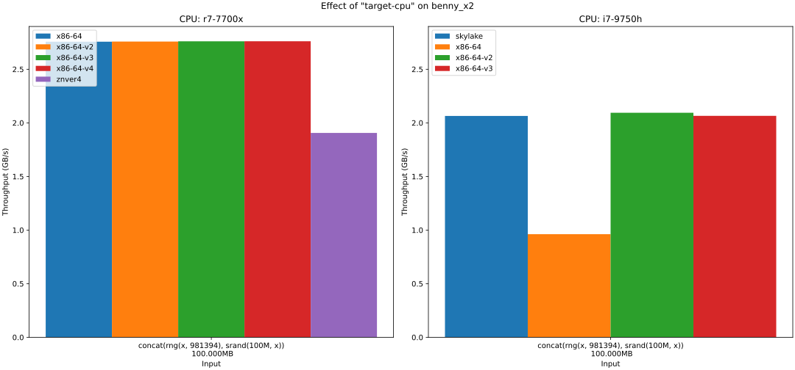
Here's the asm for the hot loop
```asm
.LBB83_11:
	movzx edx, byte ptr [rdi + r15]
	vmovd xmm4, edx
	vpinsrb xmm4, xmm4, byte ptr [rbx + r15], 1
	vpand xmm4, xmm4, xmm0
	vpmovzxbd xmm4, xmm4
	vpsllvd xmm4, xmm1, xmm4
	vpxor xmm3, xmm4, xmm3
	vpopcntd xmm4, xmm3
	vpcmpeqd k0, xmm4, xmm2
	kmovd edx, k0
	test dl, 3
	jne .LBB83_12
	movzx edx, byte ptr [rdi + r15 - 13]
	movzx r8d, byte ptr [rbx + r15 - 13]
	inc r15
	vmovd xmm4, edx
	vpinsrb xmm4, xmm4, r8d, 1
	vpand xmm4, xmm4, xmm0
	vpmovzxbd xmm4, xmm4
	vpsllvd xmm4, xmm1, xmm4
	vpxor xmm3, xmm3, xmm4
	cmp rcx, r15
	jne .LBB83_11
```
And we see that almost the entire loop uses SIMD (the instructions with xmm registers), but it's over 30% worse in practice.
Now, to be fair, micro-benchmarks like this blow these compiler shortcomings out-of-proportion.
I only mentioned this result *because* it was worse. That said, it does demonstrate room for improvement.
The first thought might be to tune the cost models in LLVM, but I think a more interesting direction is to
better integrate profiling into compiler optimizations - easier said than done.

Well, the compiler struggled to effectively vectorize `benny`, let's see what I managed.
### `Gather AVX512`
This is pretty much a vectorized version of `bbeennnnyy`.
A key part of this algorithm is the `gather` instruction,
which loads memory from several addresses into one vector.
Below is a diagram of gather's behavior for a 4-wide vector:
```
data: [1, 2, 3, 4, 5, 6, 7, 8, 9, 10, 11, 12, 13, 14, 15, 16, ...]
offsets: [0, 2, 7, 1]
ptr = data.start;
gather(ptr, offsets) => [1, 3, 8, 2]
```
With AVX512 we can gather either `8 x 8` bytes or `16 x 4` bytes (# lanes x lane size).
Meanwhile, with AVX2 we can gather either `4 x 8` bytes or `8 x 4` bytes.
I went with 16 lanes of 4 bytes for AVX512; `8 x 8` performed worse in my experiments. 
Now, gathers are fairly expensive, especially on Zen 4.
If left unchecked, these high latency instructions can stall the pipeline, which we'd observe as low IPC.
To hide this latency, we can do a sort of 'pre-fetching' where we issue gathers a few iterations in advance.
Here is that snippet from the loop body:
```rust
let next_next_data = gather(offsets_v, ptr.byte_add(8));
...
// use data
...
data = next_data;
next_data = next_next_data;
std::arch::asm!("");
```

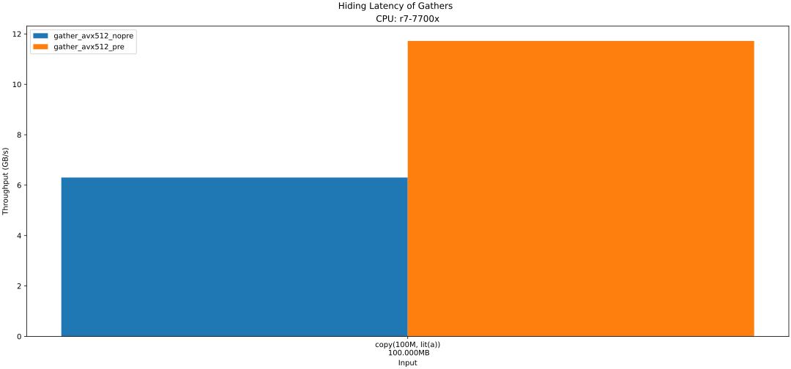
This nearly doubles the throughput, compared to no prefetching.
However, it isn't quite that simple. You've likely noticed that funny-looking empty asm block.
See, LLVM uses a cost-model to guide its decisions on how to order these instructions.
However, it [currently treats gathers as being extremely cheap on Zen 4](https://github.com/llvm/llvm-project/issues/91370),
which leads it to push those gathers to the bottom of the loop, decreasing performance by ~15%.
Adding that empty asm block prevents the compiler from moving instructions across it, 
thus keeping the `vpgatherdd` near the top of the loop, helping to hide its latency.
I first saw the technique in [a 2006 blog post by Mike Acton](https://cellperformance.beyond3d.com/articles/2006/04/a-practical-gcc-trick-to-use-during-optimization.html).

### `Gather AVX2`
I also made an AVX2 variant. Because AVX2 does not have a `popcnt` equivalent, the logic more closely follows `benny_alt`.
Frankly, it's not very good on the i7 9750h.
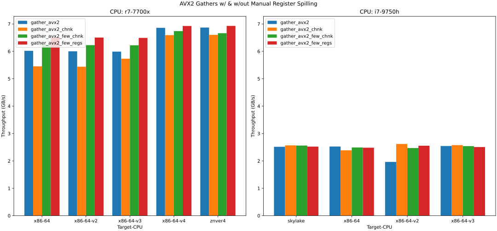
2.5 GB/s *is* better than `dap` or `bbeennnnyy`, but not by a convincing amount considering the vast difference in complexity.

## Comparisons
Here, I'll use random input to give the algorithms a level playing field.
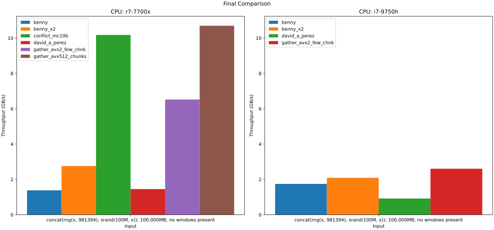
My new routines provide a significant speed-up when AVX512 is available, and a slight improvement for CPUS with AVX2. 

# Other interesting things

## Input validation
Sometimes we need to validate our input. If we can avoid doing two passes, 
one to validate and then one to process it, we'll likely save a lot of time.  
In fact, the `gather_avx512_pre` and `gather_avx512_chunks` algorithms already perform input validation.
```rust
pub unsafe fn gather_avx512_prefetch(input: &[u8]) -> Option<usize> {
    gather_avx512_base::<true>(input, true)
}

#[target_feature(enable = "avx512f,bmi1,avx512vpopcntdq,avx512bw")]
unsafe fn gather_avx512_base<const PREFETCH: bool>(input: &[u8], validate: bool) -> Option<usize> {
    ...
    if validate {
        use std::arch::x86_64::*;
        if 0 != _mm512_cmpgt_epi8_mask(
            _mm512_sub_epi8(data, _mm512_set1_epi8(b'a' as i8)),
            _mm512_set1_epi8(25),
        ) {
            // todo: return Result instead
            panic!("input contains characters outside the range a-z")
        }
    }
    ...
}
```
At least on my Zen 4, we were bottle-necked by the gather instruction, so adding a few instructions
(that don't contribute to the critical path)
and 2 predictable branches doesn't really increase contention for the resources we were short on.

## Cache Contention
For the `gather` algorithms, if all the offsets are equal modulo 4096, there is a significant slowdown. 
This is because on each iteration all 8 or 16 memory accesses target the same bucket in the cache, 
which overwhelms the associativity. 
This could be addressed by staggering the offsets, but that further complicates the algorithm.
Instead, I added a 'chunking' wrapper function, described below.
This was not a problem for the `conflict` algorithms because the cursors tend to advance at different rates.

## Chunking for better locality and staggered offsets
The `conflict` and `gather` routines partition the input evenly in several regions and search them in parallel. 
If the solution tends to be absent or towards the end, this is fine. 
However, for large inputs with early solutions, this means a lot of the work is actually wasted. 
We can solve this without rewriting all the functions by doing searches in smaller, slightly overlapping chunks. 
```rust
#[inline(always)]
unsafe fn chunked(
    input: &[u8],
    chunk_len: usize,
    func: &mut impl FnMut(&[u8]) -> Option<usize>,
) -> Option<usize> {
    let chunk_len = chunk_len.max(1024);
    let mut idx = 0usize;
    while idx < input.len() {
        if let Some(v) = func(&input[idx..input.len().min(idx + chunk_len)]) {
            return Some(v + idx);
        }
        idx += chunk_len - 13;
    }
    None
}
```
These chunks should be as small as possible, but large enough to amortize the set-up cost for each invocation.
This value is very likely to be machine-specific,
so in practice one might collect statistics and tune the chunk size at run-time.

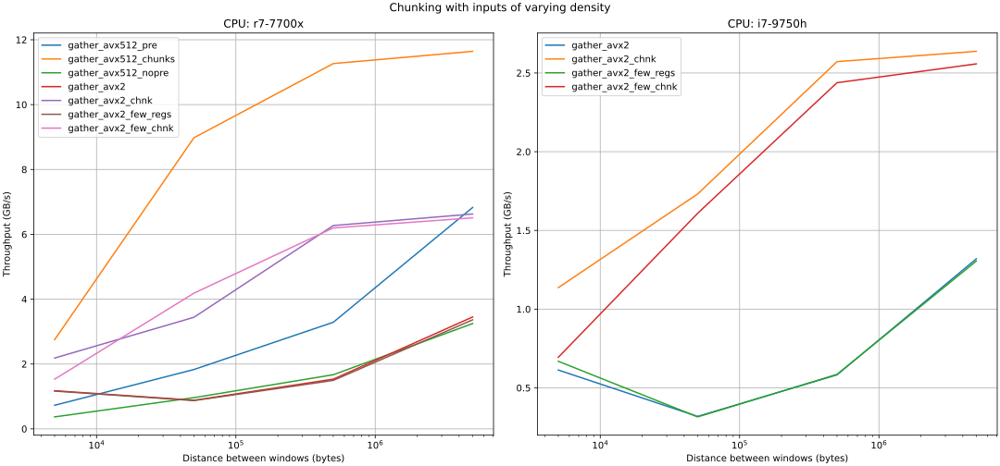
The chunking variants are highly effective in practice and would make for a reasonable default.

Other than early solutions, the chunking variant is more resilient to alignment - 
`gather_avx512_pre`, which has 16 regions,
gets significantly slower on inputs with power-of-two length, while the chunked variant is largely unaffected.
```
$ ./target/release/day6_prime_fork --fns=gather_avx512s --iters=50 \
 "copy(16Mi, lit(z))" "copy(32Mi, lit(z))" "copy(64Mi, lit(z))" "copy(65M, lit(z))"

> copy(16Mi, lit(z)); 16.777MB; no windows present
                name   threads         best       median         mean       stddev
   gather_avx512_pre         1       4.0595       4.0539       4.0532       0.0033
gather_avx512_chunks         1      10.2165      10.1909      10.1889       0.0257
 gather_avx512_nopre         1       2.3847       2.3824       2.3011       0.1096

> copy(32Mi, lit(z)); 33.554MB; no windows present
                name   threads         best       median         mean       stddev
   gather_avx512_pre         1       4.5270       4.5220       4.5022       0.0917
gather_avx512_chunks         1      11.7475      11.5704      11.5482       0.1354
 gather_avx512_nopre         1       2.3859       2.3844       2.3784       0.0332

> copy(64Mi, lit(z)); 67.109MB; no windows present
                name   threads         best       median         mean       stddev
   gather_avx512_pre         1       4.5155       4.5103       4.5098       0.0035
gather_avx512_chunks         1      11.1667      11.1171      11.1143       0.0349
 gather_avx512_nopre         1       2.3862       2.3854       2.3853       0.0008

> copy(65M, lit(z)); 65.000MB; no windows present
                name   threads         best       median         mean       stddev
   gather_avx512_pre         1      11.3132      11.2228      11.2188       0.0470
gather_avx512_chunks         1      11.1623      11.1238      11.1146       0.0387
 gather_avx512_nopre         1       5.2467       5.2418       5.2396       0.0090
```

We can see from the below `perf` stats that the chunked variant has far fewer cache misses.

---
`perf` stats for `gather_avx512_pre`
```
    21,485,386,651      cycles:u                         #    5.298 GHz                         (38.45%)
        12,279,222      stalled-cycles-frontend:u        #    0.06% frontend cycles idle        (38.45%)
    15,918,417,458      instructions:u                   #    0.74  insn per cycle            
                                                         #    0.00  stalled cycles per insn     (38.45%)
     1,076,727,898      branches:u                       #  265.522 M/sec                       (38.45%)
            20,351      branch-misses:u                  #    0.00% of all branches             (38.45%)
     4,678,545,229      L1-dcache-loads:u                #    1.154 G/sec                       (38.47%)
     1,457,401,203      L1-dcache-load-misses:u          #   31.15% of all L1-dcache accesses   (38.46%)
```
---
`perf` stats for `gather_avx512_chunks`
```
     9,139,371,596      cycles:u                         #    5.164 GHz                         (38.45%)
        14,884,254      stalled-cycles-frontend:u        #    0.16% frontend cycles idle        (38.50%)
    16,109,614,864      instructions:u                   #    1.76  insn per cycle            
                                                         #    0.00  stalled cycles per insn     (38.52%)
     1,103,826,722      branches:u                       #  623.701 M/sec                       (38.52%)
           223,361      branch-misses:u                  #    0.02% of all branches             (38.53%)
     4,748,162,531      L1-dcache-loads:u                #    2.683 G/sec                       (38.50%)
       287,434,750      L1-dcache-load-misses:u          #    6.05% of all L1-dcache accesses   (38.44%)
```
The `conflict` family doesn't suffer from this because the cursors tend to advance at different rates,
and the loads are spread out.

# Further work

## Better statistics and benchmarking
- More diverse hardware.  
  Notably, Intel's implementations of AVX512 are absent. According to instruction tables 
  at uops.info and by Agner Fog, Intel's gather performance is much better.
  Meanwhile, Zen 4's `vpconflictd` is significantly faster. 
  Also, the very recent Zen 5 chips seem to have significant improvements in vector workloads.
- Reduce noise in setup.  
  Steps such as running the CPU at a fixed frequency and booting a minimal OS. 
- To thwart the branch predictor for branchy algorithms on small inputs, use a different - but comparable - input each iteration.
  - this would require restructuring how seeds are treated during input generation. Perhaps seed[i] = `hash(base_seed, i)`?
- More rigorous statistics, especially around margin of error and p-scores.
- More automation for collecting and merging results of benchmarking over multiple runs and multiple machines.  
  See [Emery Berger's work on stabilizer](https://emeryberger.com/research/stabilizer/) 
  or his [conference talk](https://www.youtube.com/watch?v=r-TLSBdHe1A)

## Find first(n), any(n)
Very often, we don't want to find just the first instance of something, but the first *n* instances. 
Sometimes, we don't even care about the order!
While it's easy to write a generic adapter around our functions to provide the former, such as 
```rust
fn first_n(input: &[u8], n: usize, searcher: &impl Fn(&[u8]) -> Option<usize>) -> Vec<usize> {
    let mut results = Vec::<usize>::with_capacity(n);
    let mut idx = 0;  
    for _ in 0..n {
        if let Some(i) = input.get(idx..).and_then(searcher) {
            results.push(i);
            idx = i + 1;
        } else {
            break;
        }
    }
    results
}
```
it would be suboptimal, particularly for inputs with many solutions close together. 
The initialization code would be re-run many times, which is most detrimental to the SIMD algorithms.
Redesigning the algorithms to find n windows at a time would allow for the algorithms to
preserve the internal state between solutions. 
Not only that, but if we were interested in finding *all* the solutions in an input, 
it may very well be faster to find them unordered and sort afterward.


# Usage
Instructions for running the benchmarks are in `./scripts/runner.txt` and `./scripts/runner2.txt`.

The output can then be processed with `./scripts/example_plot_script1.py` and `./scripts/example_plot_script2.py`.

For other uses, pass `--help` to the binary for instructions and examples.
